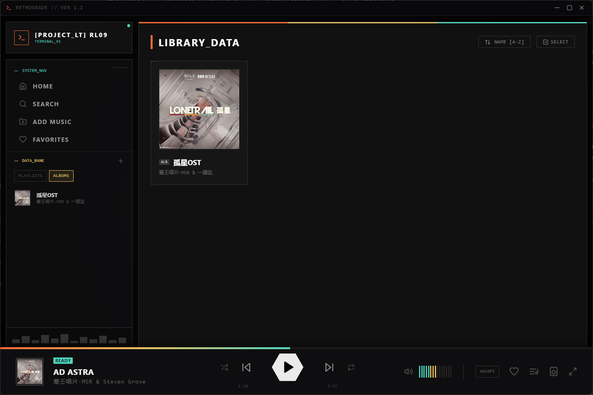
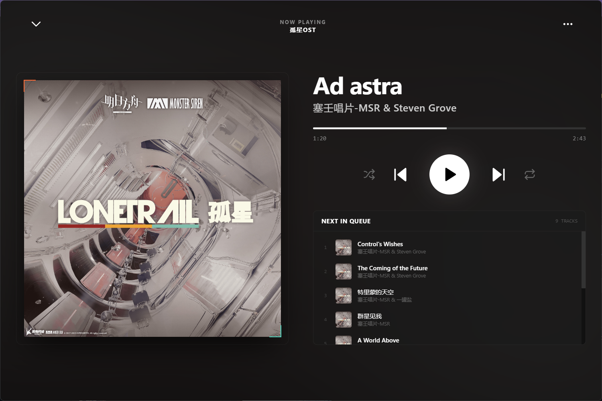

# Retrograde // Music Player


**Retrograde** is a high-fidelity, local music player built with a futuristic, terminal-inspired interface. Designed for audiophiles who appreciate visual immersion, Retrograde focuses on offline data persistence, a distinct cyberpunk aesthetic, and unique interactive elements hidden within the UI.

---

## Interface Preview

| **Library Grid View** | **Full Screen Player** |
|:---:|:---:|
|  |  |

---

## System Features

### Core Audio Protocol
* **Audiophile Playback:** Features a dual audio engine. Use the standard **HTML5 Audio API** for everyday listening, or activate **WASAPI Exclusive Mode** (powered by a native `mpv` backend) for bit-perfect, zero-latency high-fidelity playback.
* **Local Music Management:** Seamlessly scan massive local libraries. Supports high-fidelity formats (`FLAC`, `WAV`, `MP3`, `AAC`, `OGG`, `M4A`, `ALAC`, `OPUS`).
* **Multi-Threaded Scanning:** Leverages Node.js `worker_threads` and custom native FLAC binary parsing for blazing fast library indexing.
* **Intelligent Metadata:** Automatic extraction of Title, Artist, and Cover Art.
* **Persistent Local Storage:** Library data and optimized cover arts are saved locally in the user's `.retrograde` directory, ensuring near-instant load times and zero memory bloat.

### UI / UX Experience
* **Retro Futurism Aesthetic:** A high-contrast theme featuring **Teal** (`#4FD6BE`), **Gold** (`#E8C060`), and **Orange** (`#FF6B35`) against a void-black background.
* **Kinetic Visuals:** Interface includes spinning discs, pulsing tech indicators, and dynamic gradients.
* **Focus Modes:**
    * **Sidebar Nav:** Integrated navigation with system status indicators.
    * **Full Screen:** Distraction-free listening with large album art and transparent queue overlay.
* **System Integration:** Minimizes to the system tray for seamless background playback.

### Organization Module
* **Playlists & Favorites:** Create custom playlists and fast-track access to "Liked" tracks.
* **Search Engine:** Real-time filtering by Track Name, Artist, Album, or Playlist.
* **Hardware Audio Selection:** Manually choose your preferred audio output device directly from the UI.

---

## Tech Stack

* **Runtime:**  
* **Audio Engine:** `mpv` (IPC Controller) & HTML5 Audio
* **Framework:**  
* **Styling:** 
* **Icons:** Lucide React

---

## Installation & Setup

### Prerequisites
* Node.js (v18+)
* npm or yarn
* Windows OS (Required for WASAPI Exclusive Mode)

### Initialization Sequence

1.  **Clone the Repository**
    ```bash
    git clone https://github.com/Misaka545/retrograde.git
    cd retrograde
    ```

2.  **Install Dependencies**
    ```bash
    npm install
    ```

3.  **Run Development Protocols**

    * *For Desktop App (Electron):*
        ```bash
        npm run electron:dev
        ```

4.  **Build for Production**

    * *Generate Windows Installer / Portable Exe:*
        ```bash
        npm run electron:build
        ```

---